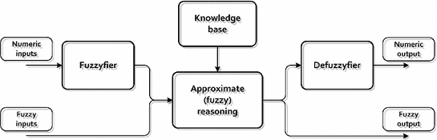

<h1 align = "center">
	Fuzzy Logic  
	
	
	
	
	
	
	
</h1>

The term “system” is usually understood as a set of interacting components with well-defined structure and organized as an intricate whole that can be distinguished from the “external” environment. A system communicates with the environment through so-called inputs and outputs.

Fuzzy systems are structures based on fuzzy techniques oriented towards information processing, where the usage of classical sets theory and binary logic is impossible or difficult. In the literature, terms such as fuzzy system, fuzzy model, system based on fuzzy rules, fuzzy controller, or fuzzy associative memory are used interchangeably depending on the application type. A typical structure of a fuzzy-based system is shown below. [1]

## References

[1] Czabanski R., Jezewski M., Leski J. (2017) Introduction to Fuzzy Systems. In: Prokopowicz P., Czerniak J., Mikołajewski D., Apiecionek Ł., Ślȩzak D. (eds) Theory and Applications of Ordered Fuzzy Numbers. Studies in Fuzziness and Soft Computing, vol 356. Springer, Cham.

